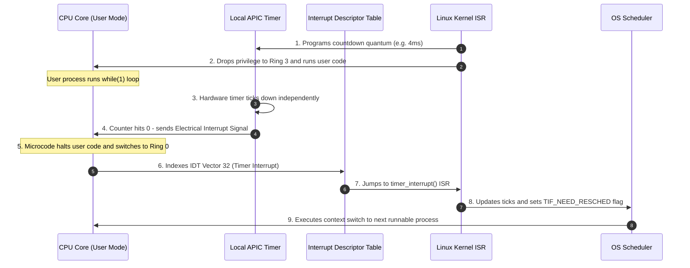

<span className="badge badge--warning margin-bottom--md">Medium</span>

> **Interview Question:** "What is a Hardware Timer Interrupt? How does the operating system regain control of the CPU from a running user application or an infinite loop without hardware assistance?"

The **Hardware Timer Interrupt** is the fundamental hardware primitive enabling **preemptive multitasking**. 

It resolves the central dilemma of operating system design: **When a user program executes on a CPU core, the operating system kernel is NOT executing on that core.** If a user process enters an infinite loop (`while(true);`), pure software is powerless to stop it. The OS must rely on physical hardware to forcibly wrest control back from the user application.

---

### The ELI5 Analogy: The Chess Clock

Imagine a strict tournament chess match:
- **The Player** (User Process) is calculating their move.
- **The Arbiter** (Operating System) cannot read the player's mind or physically push their hands away while the player is thinking. If the player chooses to sit staring at the board forever, the game freezes.
- **The Chess Clock** (Hardware Timer): Before the turn starts, the arbiter sets a physical mechanical clock for 3 minutes.
- The player thinks. When the clock reaches zero, a loud mechanical **buzzer rings** (Hardware Interrupt).
- The player is legally forced to stop immediately. The arbiter steps in, declares the turn expired, and passes the board to the next player (Context Switch).

---

### Why Software Alone Cannot Preempt a Process

To understand why hardware timers are indispensable, consider how a CPU operates:
1. A CPU core executes instructions sequentially using its Program Counter (`RIP`).
2. When the kernel dispatches a user thread, the CPU drops its privilege level to **User Mode (Ring 3)** and jumps to the user code.
3. **The OS is no longer running on that core.** It has no thread, no loop, and no active execution context.
4. If the user process refuses to yield (e.g., in a frozen game or infinite loop), no software logic inside the OS can run to intervene.
5. Only an **external electrical signal** can interrupt the CPU's fetch-decode-execute cycle.

---

### Modern Hardware Timer Architecture: Local APIC & PIT

In historical PCs, timing was governed by the **Intel 8253/8254 Programmable Interval Timer (PIT)** on the motherboard, ticking at 1.193182 MHz.

In modern multi-core x86-64 systems, timing is managed by the **Local APIC (Advanced Programmable Interrupt Controller)** built directly into each individual CPU core:



---

### Step-by-Step Chronology of a Preemptive Time Slice

1. **Arming the Timer:** Before handing the CPU to a thread, the OS programs the core's Local APIC initial count register with the process's allocated time slice (quantum, e.g., 4 ms).
2. **Dropping Privilege:** The kernel executes `sysret` or `iret`, dropping CPU execution privilege from Ring 0 to Ring 3.
3. **Independent Hardware Countdown:** The user application executes its instructions. Simultaneously, the Local APIC hardware timer decrements its counter on every bus clock cycle, completely independent of the CPU instruction pipeline.
4. **The Electrical Pulse:** When the countdown register hits zero, the APIC fires an interrupt signal directly onto the CPU core's interrupt pin.
5. **Hardware Privilege Escalation:** The CPU hardware microcode immediately:
   - Suspends the current instruction.
   - Pushes the execution state (`SS`, `RSP`, `RFLAGS`, `CS`, `RIP`) onto the thread's kernel stack.
   - Flips the CPU privilege bit back to **Kernel Mode (Ring 0)**.
6. **Interrupt Descriptor Table (IDT) Vector Lookup:** The CPU indexes the IDT at the timer vector and jumps to the kernel's registered Interrupt Service Routine (ISR) (in Linux: `timer_interrupt()`).
7. **Accounting & Scheduling Flag:** The ISR updates process runtime statistics (`update_process_times()`). If the process has exhausted its quantum, the kernel marks the thread with the `TIF_NEED_RESCHED` flag.
8. **Preemption Context Switch:** Upon returning from the interrupt, the kernel checks `TIF_NEED_RESCHED`. If set, it invokes `schedule()` to select the next ready thread and executes a context switch.

---

### Cooperative vs. Preemptive Multitasking

| Dimension | Cooperative Multitasking (Legacy) | Preemptive Multitasking (Modern) |
| :--- | :--- | :--- |
| **Pioneered By** | Windows 3.1, Classic Mac OS 9 | Linux, Windows NT/11, macOS, modern RTOS |
| **Yield Mechanism** | Processes must voluntarily call `Yield()` or sleep | Hardware timer interrupt forcibly halts the process |
| **Infinite Loop Behavior** | **Freezes entire system.** Requires hard hardware power reset. | **Zero effect on system.** OS preempts the loop smoothly after quantum expires. |
| **Context Switch Trigger** | Application software controlled | Hardware interrupt controlled |
| **Real-Time Responsiveness** | Unpredictable and fragile | Predictable, deterministic latency bounds |

---

### Modern Advancement: The Tickless Kernel (`NO_HZ`)

Traditionally, operating systems configured the hardware timer to fire periodically at a fixed frequency (e.g., $1000\text{ Hz} \implies 1\text{ ms}$ tick).

However, periodic timer interrupts cause severe issues on modern systems:
- **Idle Power Drain:** Wakes CPU cores from low-power C-states 1,000 times a second even when completely idle, draining laptop and mobile batteries.
- **Micro-Jitter in High-Performance Computing (HPC):** Interrupts pause financial trading algorithms and real-time audio threads.

**The Solution:** The Linux **Tickless Kernel** (`CONFIG_NO_HZ_IDLE` and `CONFIG_NO_HZ_FULL`):
- When a core is running only one task or is idle, the kernel **disables periodic timer ticks**.
- The hardware timer is reprogrammed dynamically in "one-shot" mode to fire only when an actual event is scheduled, allowing idle CPUs to sleep uninterrupted for seconds.

---

### Summary

"A hardware timer interrupt is an electrical signal emitted by a hardware clock (such as a core's Local APIC) when its countdown register hits zero. It solves the fundamental problem of preemption: because the OS kernel is not actively running while user code executes, the hardware timer forcibly interrupts the CPU instruction pipeline, switches privilege to Kernel Mode, and vectors into the kernel's interrupt service routine so the scheduler can preempt infinite loops and reallocate CPU time."

---

### Python Verification: Cooperative Starvation vs. Preemptive Scheduling

The following executable Python script simulates both cooperative and preemptive scheduling models, demonstrating how a CPU-bound infinite loop starves other tasks under cooperative scheduling, and how hardware timer interrupts guarantee fairness under preemptive scheduling:

```python
"""
Preemption vs Cooperative Multitasking Simulator
Demonstrates:
  1. Cooperative multitasking starvation caused by an infinite loop
  2. Preemptive multitasking driven by hardware timer interrupts
"""

from typing import List

class SimulatedProcess:
    def __init__(self, name: str, instructions: int, is_rogue_loop: bool = False):
        self.name = name
        self.instructions_remaining = instructions
        self.is_rogue_loop = is_rogue_loop
        self.instructions_executed = 0

    def run_cooperative_step(self) -> bool:
        """Runs until process voluntarily yields or finishes."""
        if self.is_rogue_loop:
            # Simulates while(true) loop that never yields
            self.instructions_executed += 5
            return False  # Never yields!
        else:
            executed = min(self.instructions_remaining, 5)
            self.instructions_remaining -= executed
            self.instructions_executed += executed
            return self.instructions_remaining == 0


def run_cooperative_simulation():
    print("--- 1. Cooperative Multitasking (No Hardware Timer) ---")
    p1 = SimulatedProcess("Proc_1 (Normal)", instructions=10)
    p2 = SimulatedProcess("Proc_2 (Infinite while(1) Loop)", instructions=100, is_rogue_loop=True)
    p3 = SimulatedProcess("Proc_3 (Normal)", instructions=10)

    queue = [p1, p2, p3]
    timeline = []

    # Process 1 runs and yields
    p1.run_cooperative_step()
    p1.run_cooperative_step()
    timeline.append(f"{p1.name} (Finished)")

    # Process 2 runs... and never yields!
    for step in range(3):
        p2.run_cooperative_step()
        timeline.append(f"{p2.name} (Hogging CPU step {step+1})")

    print(f"System State: SYSTEM FROZEN! {p3.name} never gets CPU time.")
    print("Timeline: " + " -> ".join(timeline[:4]) + " -> ... [Starvation]")


def run_preemptive_simulation():
    print("\n--- 2. Preemptive Multitasking (Hardware Timer Quantum = 3 cycles) ---")
    p1 = SimulatedProcess("Proc_1 (Normal)", instructions=6)
    p2 = SimulatedProcess("Proc_2 (Infinite while(1) Loop)", instructions=100, is_rogue_loop=True)
    p3 = SimulatedProcess("Proc_3 (Normal)", instructions=6)

    queue = [p1, p2, p3]
    QUANTUM = 3  # Hardware timer fires every 3 cycles
    total_ticks = 0
    timeline = []

    for timer_interrupt in range(1, 9):
        if not queue:
            break
        current = queue.pop(0)

        # Process executes up to quantum limit
        if current.is_rogue_loop:
            current.instructions_executed += QUANTUM
            status = "Preempted by Timer Interrupt"
            queue.append(current)  # Moved to back of ready queue
        else:
            executed = min(current.instructions_remaining, QUANTUM)
            current.instructions_remaining -= executed
            current.instructions_executed += executed
            if current.instructions_remaining > 0:
                status = "Quantum Expired (Preempted)"
                queue.append(current)
            else:
                status = "Completed"

        timeline.append(f"Tick {timer_interrupt} [{current.name.split()[0]}]: {status}")

    for entry in timeline:
        print(f"  {entry}")

    print("\nResult: Despite Proc_2 running an infinite loop, Hardware Timer Interrupts")
    print("guaranteed that Proc_1 and Proc_3 completed their workloads without starvation!")


if __name__ == "__main__":
    run_cooperative_simulation()
    run_preemptive_simulation()
```