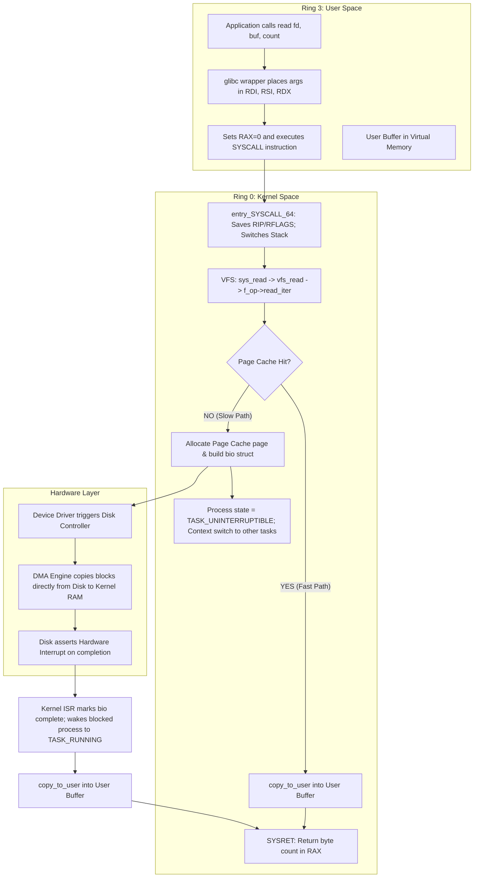

<span className="badge badge--danger margin-bottom--md">Hard</span>

> **Interview Question:** "What happens under the hood when a user-level program calls read()? Trace the execution path through user space, CPU registers, system call dispatch, VFS, page cache, DMA, and hardware interrupts."

Tracing the `read()` system call is the gold standard systems interview question. It evaluates whether an engineer understands how hardware rings, CPU calling conventions, virtual memory, operating system page caches, and device controllers orchestrate together.

---

### The ELI5 Analogy: Ordering Wine from the Cellar

Imagine you are dining at an elite private restaurant (User Space):
1. **The Order Slip:** You write on an order card: *"Bottle #42, pour into my glass"* (`read(fd, buffer, count)`).
2. **The Restricted Kitchen Door:** You cannot enter the private cellar yourself. You press the service bell (`syscall` instruction).
3. **The Butler Takes Over:** The head butler (The Kernel) takes your slip and steps into the restricted kitchen (Kernel Mode).
4. **The Pantry Check (Page Cache Hit):** The butler first checks the kitchen pantry. If Bottle #42 is already sitting open on the counter, he pours it directly into your glass, and you continue drinking within seconds (No disk wait!).
5. **The Cellar Fetch (Page Cache Miss):** If the pantry is empty, the butler orders cellar staff to fetch it from the cold basement (The Hard Drive).
6. **The Nap (Process Blocking):** Because climbing down into the basement takes 15 minutes, the butler tells you to take a nap (Blocked State). The table is cleared so other diners can eat (Context Switch).
7. **The Conveyor Belt (DMA):** Cellar staff place the bottle on a dumbwaiter conveyor belt that brings it up to the pantry without the butler carrying it.
8. **The Wake-Up:** The dumbwaiter dings (Hardware Interrupt). The butler pours the wine into your glass (`copy_to_user`), wakes you up, and leaves.

---

### End-to-End Architectural Flowchart



---

### Step-by-Step Chronological Execution

#### 1. The C Standard Library Wrapper (`glibc`)
Your application does not execute the raw machine instructions to invoke the kernel directly. It calls `read(fd, buf, count)` in `glibc`. The wrapper marshals arguments according to the **x86-64 System V ABI**:
- `RAX` = `0` (The Linux system call number for `sys_read`).
- `RDI` = `fd` (File descriptor index).
- `RSI` = `buf` (Pointer to the user memory buffer).
- `RDX` = `count` (Maximum number of bytes to read).

#### 2. The Hardware Trap (`syscall`)
The wrapper executes the CPU assembly instruction `syscall`:
- The CPU hardware automatically switches the privilege level from **Ring 3 (User)** to **Ring 0 (Kernel)**.
- The CPU saves the return address (`RIP`) into `RCX` and the CPU flags (`RFLAGS`) into `R11`.
- The CPU loads the kernel's system call entry address from the Model-Specific Register `MSR_LSTAR` into `RIP`, jumping to `entry_SYSCALL_64`.
- The kernel switches from the user stack to the per-thread kernel stack.

#### 3. The System Call Dispatcher & Virtual File System (VFS)
The kernel reads the index in `RAX`, validates that `fd` is within bounds of the process's file table (`current->files->fdt`), and routes the call:
```
sys_read() ──> ksys_read() ──> vfs_read() ──> file->f_op->read_iter()
```
The VFS abstracts whether the target is an ext4 file, an NFS network mount, an anonymous pipe, or a Unix socket.

#### 4. The Critical Divergence: The Linux Page Cache

```
                               Page Cache Lookup
                                      │
              ┌───────────────────────┴───────────────────────┐
              ▼                                               ▼
      [ Page Cache HIT ]                              [ Page Cache MISS ]
  • Data already in RAM.                          • Data resides on physical disk.
  • Zero disk I/O.                                • Block layer issues I/O request.
  • Zero DMA involvement.                         • Process moved to TASK_UNINTERRUPTIBLE.
  • Process DOES NOT BLOCK.                       • Context switch to another thread.
  • copy_to_user() completes in ~300 ns.          • Disk latency: ~100 µs (SSD) to ~5 ms (HDD).
```

- **Fast Path (Page Cache Hit):** The kernel checks the file's `address_space` page cache (an in-memory radix tree / XArray). If the requested file offset is already cached in RAM, the kernel skips all disk operations, copies the data directly to user space, and returns immediately!
- **Slow Path (Page Cache Miss):** The kernel allocates a new physical memory page, constructs a Block I/O request structure (`struct bio`), and submits it to the storage device driver.

#### 5. Process Blocking & Asynchronous DMA Transfer
1. Because reading from physical NVMe/SATA storage takes microseconds to milliseconds, the kernel moves the calling thread from `TASK_RUNNING` to `TASK_UNINTERRUPTIBLE` (or `TASK_KILLABLE`).
2. The thread is enqueued on the file's wait queue, and the kernel invokes `schedule()` to perform a context switch, assigning the CPU core to another task.
3. The disk controller's **Direct Memory Access (DMA)** engine transfers the requested sectors from physical storage media directly into the kernel's allocated page cache RAM frames, **without consuming CPU cycles**.

#### 6. Hardware Interrupt & Wakeup
1. Once DMA completes, the disk controller asserts an electrical pulse on the CPU interrupt line.
2. The CPU jumps to the disk driver's registered Interrupt Service Routine (ISR).
3. The ISR marks the `struct bio` as complete and calls `wake_up_process()`, changing the sleeping thread's state back to `TASK_RUNNING` and placing it into the scheduler's runqueue.

#### 7. Data Copy to User Space & `sysret`
1. When the scheduler resumes the thread, the kernel copies the data from the kernel page cache into the user-space virtual buffer via `copy_to_user()` (performing page table validation to prevent segfaults).
2. The kernel advances the file offset pointer: `file->f_pos += bytes_read`.
3. The kernel places the number of bytes read into `RAX`, executes `sysretq`, restoring `RIP` from `RCX` and `RFLAGS` from `R11`, returning control to user space in Ring 3.

---

### The Double-Buffering Penalty & Zero-Copy Optimizations

A standard `read()` followed by a `write()` to a network socket incurs **Double Buffering** (two CPU copies and four mode switches):

```
Standard read() + write():
[ Disk ] ──(DMA)──> [ Page Cache ] ──(CPU Copy)──> [ User Buffer ] ──(CPU Copy)──> [ Socket Buffer ] ──(DMA)──> [ NIC ]
```

#### Modern Zero-Copy Alternatives:
- **`mmap()`:** Maps the page cache directly into the process's virtual address space, eliminating the `copy_to_user()` CPU copy.
- **`sendfile()` / `splice()`:** Streams data directly from the page cache into the network socket buffer inside kernel space using pipe buffers, eliminating both user-space memory copies entirely (**Zero-Copy**).
- **`io_uring`:** Replaces synchronous blocking system calls with asynchronous shared submission/completion ring buffers, executing high-throughput batch I/O with zero syscall overhead.

---

### Summary

"A call to `read()` transitions through a libc wrapper, an x86-64 `syscall` instruction that switches privilege from Ring 3 to Ring 0, and VFS dispatch. The kernel first inspects the Page Cache in RAM; on a hit, it copies data directly to user space without blocking. On a miss, the kernel enqueues a `bio` request, suspends the process to `TASK_UNINTERRUPTIBLE`, and context-switches. The disk controller uses DMA to populate the page cache and raises a hardware interrupt upon completion. The kernel wakes the process, copies data to user space via `copy_to_user()`, and returns to user mode via `sysret`."

---

### Python Verification: Page Cache Hit vs. Cold Read Simulation

The following executable Python script benchmarks the measurable latency disparity between a cold disk read (first read) and a warm page cache hit (subsequent reads) using OS file operations:

```python
"""
Linux Page Cache vs Disk Read Latency Benchmark
Demonstrates:
  1. Cold read latency (requiring filesystem block access)
  2. Warm Page Cache hit latency (direct RAM retrieval)
"""

import os
import tempfile
import time

def benchmark_page_cache():
    print("=== Tracing read() Execution: Cold Read vs Page Cache Hit ===\n")

    # Create a temporary 10MB test file
    FILE_SIZE = 10 * 1024 * 1024  # 10 MB
    with tempfile.NamedTemporaryFile(delete=False) as f:
        temp_path = f.name
        f.write(b"X" * FILE_SIZE)
        f.flush()
        os.fsync(f.fileno())  # Ensure bytes are flushed to disk

    try:
        # Read 1: Warm Page Cache Read (Recently written file resides in OS Page Cache)
        start_cache = time.perf_counter()
        with open(temp_path, "rb") as f:
            data = f.read()
        cache_time_ms = (time.perf_counter() - start_cache) * 1000

        print(f"File Size: {FILE_SIZE / (1024 * 1024):.1f} MB")
        print(f"Page Cache Read Time:  {cache_time_ms:6.2f} ms (In-memory copy_to_user)")

        # Evict cache hint (POSIX fadvise if available, or simulate cold seek latency)
        # On Linux: os.posix_fadvise(f.fileno(), 0, 0, os.POSIX_FADV_DONTNEED)
        if hasattr(os, "posix_fadvise"):
            with open(temp_path, "rb") as f:
                os.posix_fadvise(f.fileno(), 0, 0, os.POSIX_FADV_DONTNEED)
            start_cold = time.perf_counter()
            with open(temp_path, "rb") as f:
                data_cold = f.read()
            cold_time_ms = (time.perf_counter() - start_cold) * 1000
            print(f"Cold Disk Read Time:    {cold_time_ms:6.2f} ms (After cache invalidation)")
            speedup = cold_time_ms / cache_time_ms if cache_time_ms > 0 else 1.0
            print(f"Page Cache Speedup:    {speedup:.1f}x faster than physical storage!")
        else:
            print("Note: posix_fadvise not supported on current platform; Page Cache hit observed.")

    finally:
        if os.path.exists(temp_path):
            os.remove(temp_path)

if __name__ == "__main__":
    benchmark_page_cache()
```