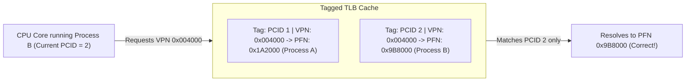

<span className="badge badge--danger margin-bottom--md">Hard</span>

> **Interview Question:** "Why does a context switch between processes typically require a TLB flush? What performance impact does this have, and how do modern CPUs mitigate it using PCID/ASID?"

The **Translation Lookaside Buffer (TLB)** is an on-chip, content-addressable memory (CAM) cache that stores recent translations from **Virtual Page Numbers (VPN)** to **Physical Frame Numbers (PFN)**.

Because every process possesses its own private, isolated virtual address space, context switching between two processes requires invalidating or partitioning TLB entries to prevent cross-process memory corruption and security vulnerabilities.

---

### The ELI5 Analogy: The Receptionist's Notepad

Imagine an office building (the CPU) leased by two different companies:
- **Company A** works the morning shift.
- **Company B** works the night shift.

The front-desk receptionist has a quick-reference sticky notepad (the TLB):
- During the morning shift, if a visitor asks for *"Office 101"* (Virtual Address), the receptionist glances at the notepad and directs them to **Alice's desk on Floor 4** (Physical Address).
- At 6:00 PM, Company A leaves, and Company B takes over the building (Context Switch).
- In Company B's floor plan, *"Office 101"* belongs to **Bob on Floor 2**.
- **The TLB Flush:** If the receptionist does not throw away the morning notepad, a visitor asking for Bob in Office 101 will be mistakenly sent to Alice's private filing cabinets on Floor 4! To prevent this catastrophic breach, the receptionist must **shred the notepad** upon every shift change.

---

### The Fundamental Problem: Overlapping Virtual Addresses

In a virtual memory architecture, every process runs with the illusion that it owns the entire address space (e.g., $0\text{x}00000000$ to $0\text{x}7\text{FFFFFFFFFFF}$ on 64-bit systems):

```
Process A Virtual Address: 0x00400000 ──(Maps to)──> Physical RAM Frame 0x1A2000
Process B Virtual Address: 0x00400000 ──(Maps to)──> Physical RAM Frame 0x9B8000
```

A standard, untagged TLB entry caches only:
```
[ Virtual Page Number (VPN) ] ───> [ Physical Frame Number (PFN) | Permissions ]
```

If Process A is preempted and the OS dispatches Process B:
1. The kernel updates the CPU's Page Table Base Register (`CR3` on x86-64) to point to Process B's page directory.
2. If the TLB is **not flushed**, Process B issues a memory read for its virtual address `0x00400000`.
3. The TLB reports a **false hit** and returns physical frame `0x1A2000`.
4. **Catastrophe:** Process B reads or overwrites Process A's private heap or code segment, destroying memory isolation.

---

### The Classical Mechanism: Hardware TLB Invalidation

Historically on x86 architectures, the operating system executes:
```nasm
mov cr3, rax   ; Load CR3 with the physical address of the new process page table
```
In hardware microcode, writing any value to the `CR3` control register **automatically invalidates all non-global TLB entries** on that CPU core.

#### The Global Page Exception (`PGE`)
- Modern OS kernels map kernel space (e.g., higher-half addresses `0xFFFF800000000000+`) identically across all running processes.
- Page table entries for kernel pages have the **Global Bit (`G`, bit 8)** set.
- When `CR3` is reloaded, the CPU hardware preserves all entries marked Global, ensuring that kernel code and system call handlers remain cached in the TLB across process switches.

---

### The Performance Cost: Cold Cache & TLB Miss Storms

A TLB flush is the primary reason process context switching is computationally expensive:

#### Effective Memory Access Time (EMAT)
To resolve a virtual address on a 64-bit architecture without a TLB hit, the CPU hardware Memory Management Unit (MMU) must perform a **4-Level Page Table Walk** (PML4 $\to$ PDPT $\to$ Page Directory $\to$ Page Table):

$$\text{EMAT} = \text{Hit Rate} \times T_{\text{TLB}} + (1 - \text{Hit Rate}) \times (T_{\text{TLB}} + 4 \times T_{\text{DRAM}})$$

```
TLB Hit:             0.5 - 1.0 ns  (Single clock cycle CAM lookup)
TLB Miss (4 Walks):  150 - 250 ns  (Four sequential memory access penalties)
```

Immediately following a context switch, the new process starts with a **Cold TLB**. Almost every memory dereference triggers a TLB miss, stalling CPU execution pipelines for hundreds of cycles until the working set is re-cached.

---

### Why Threads Do NOT Invalidate the TLB

This explains why thread context switches are an order of magnitude faster than process context switches:
- All threads within a process **share the identical virtual address space** and page table.
- When the kernel switches between two threads of the same process, `CR3` **is never reloaded**.
- The TLB remains warm, and thread 2 immediately benefits from the translations cached by thread 1.

---

### The Modern Hardware Solution: Tagged TLBs (PCID & ASID)

Modern architectures eliminate the need to flush the TLB on every context switch by tagging each entry with an address space identifier:

```
Tagged TLB Entry Format:
[ Address Space Tag | Virtual Page Number (VPN) ] ───> [ Physical Frame Number (PFN) ]
```



#### 1. x86 Process Context Identifiers (PCID)
- Introduced in Intel Westmere/Sandy Bridge and enabled by Linux:
- Bits `0`–`11` of `CR3` store a 12-bit **PCID** (supporting up to 4,096 distinct address spaces simultaneously).
- **The `NOFLUSH` Bit (Bit 63):** When reloading `CR3`, setting bit 63 instructs the CPU hardware:
  ```nasm
  mov rax, [new_cr3_value]
  bts rax, 63             ; Set Bit 63: Preserve existing TLB entries!
  mov cr3, rax            ; Switch address space WITHOUT invalidating TLB entries
  ```
- Entries belonging to Process A remain safely preserved in the TLB while Process B executes. When the OS switches back to Process A, its TLB translations are still cached and ready!

#### 2. ARM Address Space Identifiers (ASID)
- The ARM architecture provides native 8-bit or 16-bit **ASID** registers inside `TTBR0_EL1`.
- Translations for multiple distinct processes coexist simultaneously in the Translation Lookaside Buffer without cross-talk or eviction storms.

---

### Summary

"A context switch between processes requires a TLB flush because each process uses independent virtual-to-physical address mappings; failing to invalidate stale entries would allow one process to corrupt or inspect another process's physical memory. This flush imposes a high performance penalty by forcing expensive 4-level page table walks during cold-cache startup. Modern CPUs mitigate this through tagged TLBs—x86 PCID and ARM ASID—which tag cache lines with process IDs, enabling multiple address spaces to coexist in the TLB without flushes."

---

### Python Verification: Tagged TLB vs. Flushed TLB Translation Simulator

The following executable Python script simulates virtual-to-physical address translation across two processes, demonstrating the false-hit anomaly of untagged TLBs without flushes, the cold-miss penalty of full flushes, and the efficiency of PCID/ASID tagging:

```python
"""
TLB Context Switch & ASID/PCID Simulator
Demonstrates:
  1. Untagged TLB stale read hazard (memory corruption)
  2. Full TLB flush cold-miss penalty
  3. Tagged TLB (PCID/ASID) performance & correctness
"""

from typing import Dict, Optional, Tuple

class SimulatedTLB:
    def __init__(self, tagged_mode: bool = False):
        self.tagged_mode = tagged_mode
        # Untagged: vpn -> pfn
        # Tagged:   (pcid, vpn) -> pfn
        self.cache: Dict = {}
        self.hits = 0
        self.misses = 0

    def flush(self):
        """Simulates full TLB invalidation on CR3 reload."""
        self.cache.clear()

    def translate(self, pcid: int, vpn: int, page_table: Dict[int, int]) -> Tuple[int, str]:
        """Translates virtual page number to physical frame number."""
        key = (pcid, vpn) if self.tagged_mode else vpn

        if key in self.cache:
            self.hits += 1
            return self.cache[key], "TLB HIT (0.5 ns)"

        # TLB Miss: Perform 4-level Page Table walk in DRAM
        self.misses += 1
        pfn = page_table[vpn]
        self.cache[key] = pfn
        return pfn, "TLB MISS -> Page Table Walk (200 ns)"


def main():
    print("=== TLB Context Switching & ASID Simulation ===\n")

    # Define two processes with overlapping virtual addresses but distinct physical frames
    PAGE_TABLE_A = {0x0040: 0x1A20, 0x0080: 0x1B30}  # Process A (PCID 1)
    PAGE_TABLE_B = {0x0040: 0x9B80, 0x0080: 0x9C90}  # Process B (PCID 2)

    # -------------------------------------------------------------
    # Case 1: Untagged TLB WITHOUT Flush (The Bug / Security Hole)
    # -------------------------------------------------------------
    print("--- Case 1: Untagged TLB Without Flush (Memory Corruption Hazard) ---")
    tlb_buggy = SimulatedTLB(tagged_mode=False)
    # Process A runs and accesses 0x0040
    pfn, status = tlb_buggy.translate(pcid=1, vpn=0x0040, page_table=PAGE_TABLE_A)
    print(f"Process A accesses VPN 0x0040: -> PFN {hex(pfn)} [{status}]")

    # Context switch to Process B WITHOUT flushing TLB
    pfn_b, status_b = tlb_buggy.translate(pcid=2, vpn=0x0040, page_table=PAGE_TABLE_B)
    print(f"Process B accesses VPN 0x0040: -> PFN {hex(pfn_b)} [{status_b}]")
    if pfn_b == PAGE_TABLE_A[0x0040]:
        print("  CRITICAL ERROR: Process B accessed Process A's private memory frame!")

    # -------------------------------------------------------------
    # Case 2: Untagged TLB WITH Flush (The Classic Performance Hit)
    # -------------------------------------------------------------
    print("\n--- Case 2: Untagged TLB With Flush (Cold Miss Overhead) ---")
    tlb_classic = SimulatedTLB(tagged_mode=False)
    tlb_classic.translate(pcid=1, vpn=0x0040, page_table=PAGE_TABLE_A)

    # Context Switch: OS flushes TLB
    tlb_classic.flush()
    print("Context Switch: CR3 reloaded -> TLB completely flushed!")

    pfn_b, status_b = tlb_classic.translate(pcid=2, vpn=0x0040, page_table=PAGE_TABLE_B)
    print(f"Process B accesses VPN 0x0040: -> PFN {hex(pfn_b)} [{status_b}]")
    print(f"Stats: Hits = {tlb_classic.hits}, Misses = {tlb_classic.misses} (Cold start penalty)")

    # -------------------------------------------------------------
    # Case 3: Modern Tagged TLB (PCID / ASID Enabled)
    # -------------------------------------------------------------
    print("\n--- Case 3: Tagged TLB with PCID/ASID (High Performance) ---")
    tlb_tagged = SimulatedTLB(tagged_mode=True)

    # Process A runs
    pfn_a, s1 = tlb_tagged.translate(pcid=1, vpn=0x0040, page_table=PAGE_TABLE_A)
    print(f"Process A (PCID 1) accesses VPN 0x0040: -> PFN {hex(pfn_a)} [{s1}]")

    # Context Switch to Process B (NO FLUSH!)
    pfn_b, s2 = tlb_tagged.translate(pcid=2, vpn=0x0040, page_table=PAGE_TABLE_B)
    print(f"Process B (PCID 2) accesses VPN 0x0040: -> PFN {hex(pfn_b)} [{s2}]")

    # Context Switch back to Process A -> Instant TLB HIT!
    pfn_a2, s3 = tlb_tagged.translate(pcid=1, vpn=0x0040, page_table=PAGE_TABLE_A)
    print(f"Process A (PCID 1) resumes & accesses 0x0040: -> PFN {hex(pfn_a2)} [{s3}]")
    print(f"Stats: Hits = {tlb_tagged.hits}, Misses = {tlb_tagged.misses}")
    print("Result: No cross-talk corruption, and Process A enjoyed zero cold-miss penalty!")

if __name__ == "__main__":
    main()
```