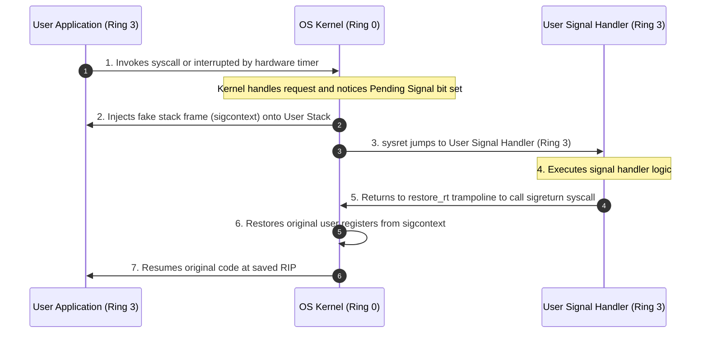

<span className="badge badge--warning margin-bottom--md">Medium</span>

> **Interview Question:** "What are signals in Unix/Linux? How do they differ from standard IPC, how does the kernel physically dispatch a signal handler onto user space, and why is calling `printf()` or `malloc()` inside a signal handler dangerous?"

A **Signal** is an asynchronous software interrupt delivered by the operating system kernel to a process to notify it that an event has occurred.

Unlike standard Inter-Process Communication (IPC) channels like pipes or shared memory (which transmit structured data payloads), a signal carries almost **no data** (historically just an integer signal number). Instead, it forcibly interrupts the target process's normal instruction flow, requiring the process to react immediately.

---

### The ELI5 Analogy: The Student and the Fire Alarm

Imagine a student (a Process) taking a strict 3-hour math exam (executing instructions on the CPU):
- **The Tap on the Shoulder (`SIGINT` / `SIGTERM`):** The teacher taps the student and says: *"Please sharpen your pencil."* The student pauses their calculation, sharpens the pencil (a custom Signal Handler), and resumes the test right where they left off.
- **The Evacuation Alarm (`SIGKILL`):** The building's emergency fire alarm blares. The school administration (the OS Kernel) does not negotiate or ask for permission. The student is physically escorted out of the building immediately. The test is over.
- **The Calculator Meltdown (`SIGSEGV`):** The student tries to divide by zero on their calculator and it explodes. The test cannot continue because the current step suffered a fatal hardware crash.

---

### Signal Generation vs. Signal Delivery

A common interview trap is assuming a signal is executed the exact nanosecond it is sent:
1. **Signal Generation:** An event triggers a signal (e.g., hardware exception, terminal `Ctrl+C`, or another process calling `kill(pid, sig)`).
2. **Signal Pending:** The kernel marks a bit in the target process's `task_struct->pending.signal` bitmask. If the process is currently blocked or running in user mode, the signal sits in **Pending** state.
3. **Signal Delivery:** The kernel only delivers and executes the signal **at the boundary when transitioning from Kernel Mode back to User Mode** (such as returning from a system call, timer interrupt, or page fault handler).

---

### The POSIX "Big Eight" Signals

| Signal | Number | Default Action | Catchable? | Common Trigger & Systems Role |
| :--- | :--- | :--- | :--- | :--- |
| **`SIGINT`** | 2 | Terminate | **Yes** | Sent by terminal driver when the user presses `Ctrl+C`. Applications catch this to prompt for exit confirmation. |
| **`SIGQUIT`** | 3 | Terminate + Core Dump | **Yes** | Sent by terminal driver when pressing `Ctrl+\`. Dumps memory state to disk for post-mortem debugging. |
| **`SIGKILL`** | 9 | Terminate | **NO** | The kernel's ultimate kill switch (`kill -9`). Destroys the process immediately. **Cannot be caught, blocked, or ignored.** |
| **`SIGSEGV`** | 11 | Terminate + Core Dump | **Yes** | Segmentation fault; triggered by hardware MMU when dereferencing an invalid virtual address (e.g., null pointer). |
| **`SIGTERM`** | 15 | Terminate | **Yes** | Standard graceful shutdown request sent by `kill pid` or systemd. Web servers catch this to finish inflight requests. |
| **`SIGCHLD`** | 17 | Ignore | **Yes** | Sent to a parent process whenever a child process terminates or stops, prompting the parent to call `waitpid()`. |
| **`SIGSTOP`** | 19 | Stop (Pause) | **NO** | Forcibly suspends the process. **Cannot be caught, blocked, or ignored.** |
| **`SIGTSTP`** | 20 | Stop (Pause) | **Yes** | Terminal stop request issued by pressing `Ctrl+Z`. Software can catch this to perform custom suspension actions. |

> **Interview Gold:** Only two signals in the entire POSIX specification **cannot be caught, blocked, or ignored**: **`SIGKILL`** and **`SIGSTOP`**.

---

### How the Kernel Executes a Signal Handler: The Trampoline

A signal handler is written in user code, but the kernel executes in Ring 0. How does the kernel invoke user code without granting it kernel privileges?



1. **Stack Frame Injection:** The kernel constructs a fake stack frame on the **user's stack** containing a `struct sigcontext` (preserving the original user registers, flags, and `RIP`).
2. **Execution Redirection:** When the kernel executes `sysret` to return to User Mode, it sets the CPU instruction pointer (`RIP`) to the address of the user's registered **signal handler function**.
3. **The Trampoline Return:** The return address on the fake stack is pointed to a kernel-provided trampoline function (`__restore_rt`).
4. **`sigreturn()` Syscall:** When the signal handler finishes, it returns to the trampoline, which executes the `sigreturn()` system call.
5. The kernel catches `sigreturn()`, restores the original user registers from the saved `sigcontext`, and seamlessly resumes the main program where it was interrupted.

---

### The Lethal Concurrency Trap: Async-Signal-Safety

A favorite interview question: *"Can you call `malloc()`, `free()`, or `printf()` inside a signal handler?"*

The answer is an emphatic **NO**. 

#### Why `printf()` and `malloc()` Cause Deadlocks:
- Functions like `malloc()` and `printf()` use internal non-reentrant mutual exclusion locks to protect the global heap and standard output buffers.
- Suppose the main application thread is inside `malloc()`, having acquired the heap lock.
- A signal arrives. The kernel halts the thread and immediately vectors execution to the signal handler on the **same thread**.
- If the signal handler calls `malloc()`, it attempts to acquire the heap lock already held by itself!
- **Deadlock:** The thread blocks waiting for itself to release the lock, freezing the entire process forever.

#### Writing Safe Signal Handlers:
1. **Use Async-Signal-Safe Functions Only:** The POSIX standard defines a small whitelist of reentrant functions safe for signal handlers (e.g., `write()`, `_exit()`).
2. **The Flag Pattern:** The safest pattern is simply setting a `volatile sig_atomic_t` flag inside the handler and letting the main loop process the shutdown asynchronously:
   ```c
   static volatile sig_atomic_t shutdown_requested = 0;

   void handle_sigterm(int sig) {
       shutdown_requested = 1; // Atomic, async-safe assignment
   }
   ```

---

### Summary

"Unix signals are asynchronous software interrupts used for process control and event notification. They are recorded in the process's pending bitmask and delivered when returning from kernel space to user space. The kernel redirects execution to user handlers using a synthetic stack frame and a sigreturn trampoline. Crucially, SIGKILL and SIGSTOP cannot be caught or blocked, and signal handlers must restrict execution to async-signal-safe functions to avoid self-deadlocks on internal library locks."

---

### Python Verification: Signal Handling & Graceful Shutdown Simulation

The following executable Python script demonstrates capturing asynchronous signals (`SIGINT`, `SIGTERM`), preventing race conditions using the atomic flag pattern, and simulating a production graceful shutdown:

```python
"""
Unix Signal Handling & Graceful Shutdown Simulator
Demonstrates:
  1. Catching asynchronous signals (SIGINT, SIGTERM)
  2. The atomic flag pattern for async-safety
  3. Clean termination and resource disposal
"""

import signal
import time
import sys

class GracefulServer:
    def __init__(self):
        self.running = True
        self.tasks_completed = 0
        self._setup_signals()

    def _setup_signals(self):
        # Register handlers for SIGINT (Ctrl+C) and SIGTERM (kill)
        signal.signal(signal.SIGINT, self._signal_handler)
        signal.signal(signal.SIGTERM, self._signal_handler)
        print("Registered handlers for SIGINT (2) and SIGTERM (15).")

    def _signal_handler(self, signum, frame):
        sig_name = signal.Signals(signum).name
        print(f"\n[SIGNAL INTERRUPT] Received {sig_name} ({signum})!")
        print("  -> Setting shutdown flag. Completing in-flight transactions...")
        # Strictly toggle flag (Async-Signal-Safe pattern)
        self.running = False

    def run_event_loop(self, max_cycles: int = 5):
        print("Server running event loop (Simulating active requests)...")
        for i in range(1, max_cycles + 1):
            if not self.running:
                break
            print(f"  Processing request #{i}...")
            self.tasks_completed += 1
            time.sleep(0.1)

            # Programmatically fire a simulated SIGTERM on cycle 3
            if i == 3 and self.running:
                print("  [Simulating OS sending SIGTERM to self...]")
                # In Python, raise signal on the main thread
                signal.raise_signal(signal.SIGTERM)

        self._cleanup()

    def _cleanup(self):
        print("\n--- Executing Graceful Shutdown ---")
        print(f"Flushing logs... (Total requests served: {self.tasks_completed})")
        print("Closing database connections...")
        print("Server shutdown complete. Process exiting cleanly.")


def main():
    print("=== Unix Signal Handling Simulation ===\n")
    server = GracefulServer()
    server.run_event_loop(max_cycles=5)

if __name__ == "__main__":
    main()
```