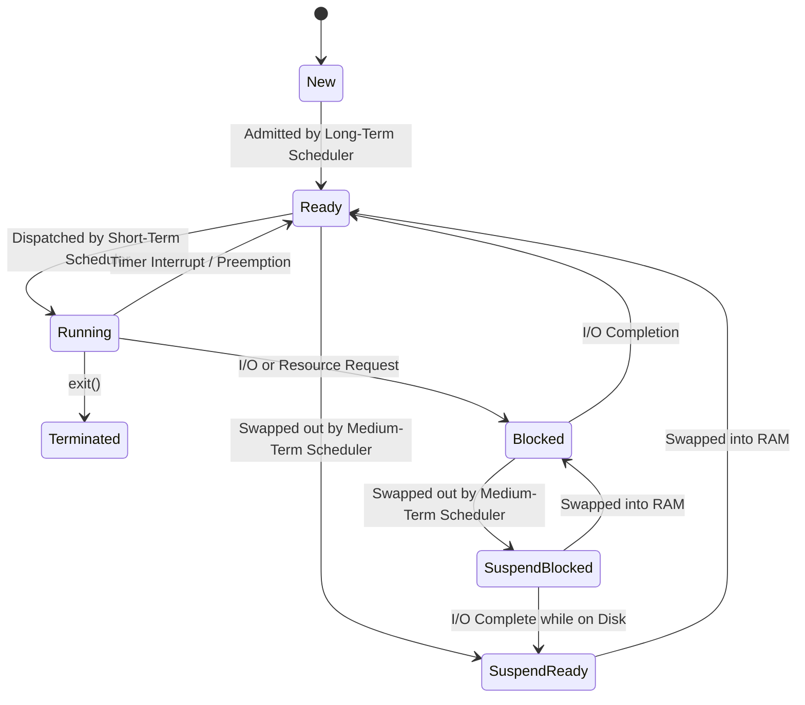

<span className="badge badge--success margin-bottom--md">Easy</span>

> **Interview Question:** "What are the different states a process transitions through? How does the 7-state model handle memory swapping, and what are the roles of the long-term, medium-term, and short-term schedulers?"

The Operating System manages hundreds of concurrent programs by orchestrating processes through a formal state machine. While standard textbooks introduce the **5-State Model**, production systems (like Linux and Windows) implement the **7-State Model** to handle virtual memory swapping under heavy RAM pressure.

---

### The ELI5 Analogy: The Medical Clinic

Imagine a process is a patient visiting a specialized clinic:
- **New:** Patient filling out admission forms at the reception desk.
- **Ready:** Patient sitting in the primary waiting room inside the clinic, waiting for the doctor.
- **Running:** Patient inside the examination room with the doctor (CPU).
- **Blocked (Waiting):** Doctor sends patient for an X-ray (I/O). The doctor cannot continue until the X-ray results return.
- **Suspend Blocked (Outside Waiting):** The clinic waiting room is overcrowded (RAM exhausted). The patient waiting for X-ray results is told to wait outside in a heated tent across the street (swapped out to disk).
- **Suspend Ready:** The X-ray is done! The patient is ready to see the doctor, but the waiting room is still full, so they stay in the tent until a seat inside opens up.
- **Terminated:** Examination complete; patient is discharged and leaves.

---

### The 7-State Transition Model



---

### Deep Dive: The Three Schedulers

| Scheduler | Common Name | Frequency | Primary Responsibility |
| :--- | :--- | :--- | :--- |
| **Long-Term Scheduler** | Job Scheduler | Seconds / Minutes | Decides which programs are admitted into memory from disk; **controls the degree of multiprogramming**. |
| **Short-Term Scheduler** | CPU Scheduler | Milliseconds (1-10 ms) | Selects which process in the in-memory `Ready Queue` gets CPU execution time. Must be blazingly fast. |
| **Medium-Term Scheduler** | Swapper | Hundreds of ms | Manages memory oversubscription. **Swaps processes out to disk** when physical RAM is exhausted. |

---

### Process State Descriptions

1. **New (Created):** Process Control Block (PCB) is created; program code exists on secondary storage.
2. **Ready:** Program is loaded into physical RAM and waits in the Ready Queue for CPU dispatch.
3. **Running:** Instructions are actively executing on a CPU core.
4. **Blocked (Waiting):** Process cannot continue until an external event (disk I/O, network socket, mutex lock) completes.
5. **Suspend Ready (Swapped):** Process is ready to execute, but its pages have been swapped out to secondary storage (swap partition/file) to alleviate RAM pressure.
6. **Suspend Blocked (Swapped):** Process is waiting for an event *and* its pages reside on swap disk.
7. **Terminated:** Execution finished or killed. Process remains briefly as a zombie until the parent reads its exit status code.

---

### Linux Kernel Process States (`ps aux` / `/proc`)

In Linux, process states map to specific single-letter flags visible in `top` and `ps`:
- **`R` (Running / Runnable):** Executing on CPU or sitting in the runqueue.
- **`S` (Interruptible Sleep):** Waiting for an event/signal (e.g., waiting for user input or timer).
- **`D` (Uninterruptible Sleep):** Waiting for hardware I/O (usually disk or network filesystem). Cannot be killed, even with `kill -9`!
- **`T` (Stopped / Traced):** Paused by a signal (e.g., `Ctrl+Z` / `SIGSTOP`) or debugger.
- **`Z` (Zombie):** Terminated, but waiting for its parent process to invoke `wait()` to collect its exit status.

---

### Summary
"Processes transition through New, Ready, Running, Blocked, and Terminated states. Under physical RAM pressure, the medium-term scheduler swaps processes to disk, creating Suspend Ready and Suspend Blocked states. The long-term scheduler controls admission, the short-term scheduler dispatches CPU time, and the medium-term scheduler balances memory usage."

---

### Crucial Nuance: The Danger of the `D` State (Uninterruptible Sleep)
Processes in state `D` are waiting for synchronous hardware drivers or kernel locks. Because they ignore all POSIX signals, **a process in the `D` state cannot be terminated with `kill -9`**. If a network filesystem (NFS) server hangs while a process is reading from it, the process stays in `D` state indefinitely, holding resources until the server recovers or the host machine is rebooted.

---

### Code Demonstration: Observing Process States in Python

```python
import os
import time
import subprocess

def get_process_state(pid: int) -> str:
    """Reads the state character from the Linux /proc filesystem."""
    try:
        with open(f"/proc/{pid}/stat", "r") as f:
            fields = f.read().split()
            # The state character is the 3rd field in /proc/[pid]/stat
            return fields[2]
    except FileNotFoundError:
        return "TERMINATED"

if __name__ == "__main__":
    current_pid = os.getpid()
    print(f"[Main] Current Process PID: {current_pid}")
    print(f"[Main] State while running: {get_process_state(current_pid)}")  # 'R'

    # Fork a child to observe sleeping / blocked state
    child_pid = os.fork()
    if child_pid == 0:
        # Child sleeps (transitions from Running to Interruptible Sleep 'S')
        time.sleep(2)
        os._exit(0)
    else:
        # Parent inspects child state while it sleeps
        time.sleep(0.5)
        print(f"[Parent] Child PID {child_pid} state during sleep: {get_process_state(child_pid)}") # 'S'
        
        # Wait for child to exit
        os.waitpid(child_pid, 0)
        print(f"[Parent] Child finished and reaped.")
```